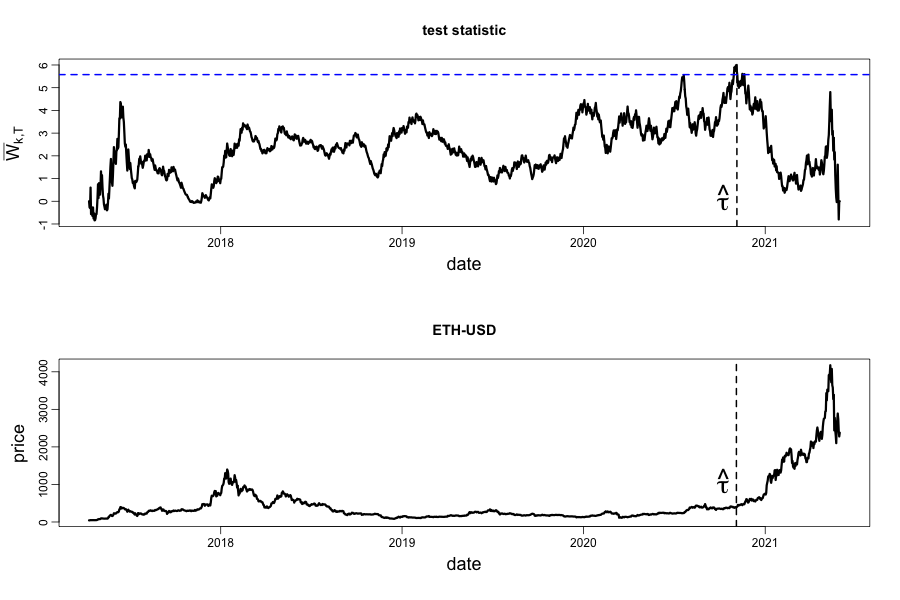
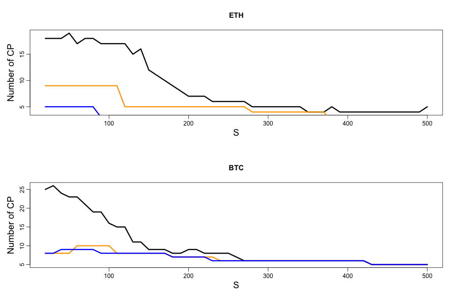
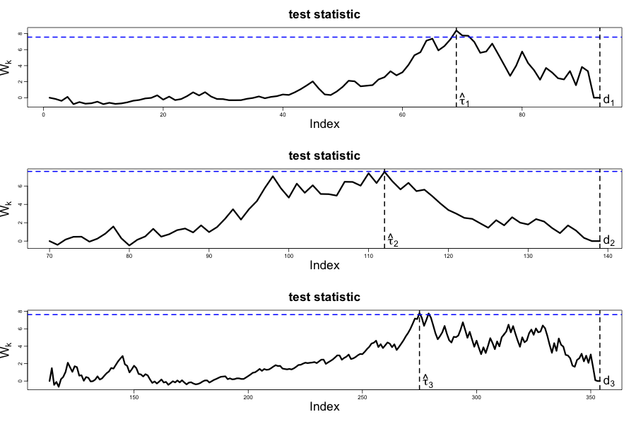

[](http://quantlet.de/)

## [](http://quantlet.de/) **CPD** [](http://quantlet.de/)

```yaml

Name of Quantlet: 'CPD'

Published in: 'DEDA class of summer term 2021'

Description: 'We perform a sequential non-parametric change point detection method in distribution for BTC and ETH, individually. Then, we apply the PCA on both time series and use the same method to find change points. A sensitivity analysis is conducted, showing that the number of estimated change points reduces as we decrease the starting period, as well as when we increase the ARL. '

Keywords: 'change point detection, non-parametric, Cramer von Mises Test, change in distribution, PCA' 

Author: 'Ratmir Miftachov'

See also: 'optional: listing related Quantlets or Github code'

Submitted:  'optional: e.g. 01. Jan 2019, John Doe'

Datafile: 'optional: for your data sets - delete if not used'

Input: 'optional'

Output:  'optional'

```









### R Code
```r

library(cpm) # currently used

# load data (BTC)
data_raw <- read.csv("BTC.csv") #data frame
data <- as.numeric(as.matrix(data_raw[,2]))
data[which(is.na(data)==TRUE)] <- data[(which(is.na(data)==TRUE)-2)]
dates <- as.Date(data_raw$Date)
returns <- matrix(diff(log(data)))

dates <- dates[-1] # align dates with returns
data <- data[-1] # align data with returns


# load ETH
data_raw_eth <- read.csv("ETH.csv") #data frame
data_eth <- as.numeric(as.matrix(data_raw_eth[,2]))
data_eth[which(is.na(data_eth)==TRUE)] <- data_eth[(which(is.na(data_eth)==TRUE)-2)]
returns_eth <- matrix(diff(log(data_eth)))
data_eth <- data_eth[-1] # align data with returns


# load LTC
data_raw_ltc <- read.csv("LTC.csv") #data frame
data_ltc <- as.numeric(as.matrix(data_raw_ltc[,2]))
data_ltc[which(is.na(data_ltc)==TRUE)] <- data_ltc[(which(is.na(data_ltc)==TRUE)-2)]
returns_ltc <- matrix(diff(log(data_ltc)))
data_ltc <- data_ltc[-1] # align data with returns


# cut the data for presentation
dates <- dates[-(1:314)]
returns <- returns[-(1:314)]
returns_eth <- returns_eth[-(1:314)]
data <- data[-(1:314)]
data_eth <- data_eth[-(1:314)]

data_ltc <- data_ltc[-(1:314)]
##################################################################################

#PCA (approach 1)
# Step1: Standardisation (mean=0, sd=1)
X1 <- (returns - mean(returns))/sd(returns)
X2 <- (returns_eth - mean(returns_eth))/sd(returns_eth)
X <- cbind(X1,X2)
#Step2:
#cov <- t(X)%*%X
cov <- cov(X)
ZZ <- eigen(cov)
eig_vec <- ZZ$vectors
comp <- X%*%eig_vec
comp1 <- comp[,1]
plot(comp1, type="l")
# first component explains 0.85% of variance


##################################################################################


#Step1: Estimate change points in distribution

# BTC
test2 <- processStream(returns, cpmType = "Cramer-von-Mises", ARL0 = 1000, startup = 50)
# ETH
test2_eth <- processStream(returns_eth, cpmType = "Cramer-von-Mises", ARL0 = 100, startup = 30 ) #50 war in aktuellster Präsi. An dieser Stelle soll
# eine Sensitivitätsanalyse gemacht werden. D.h. startup=10,20,50,100,200,500 und Ergebnisse gescheit in keynote rein tun. arl=1000


#offline for BTC keynote (explanation purpose):
test2_offline_eth <- detectChangePointBatch(returns_eth, cpmType = "Cramer-von-Mises", alpha=0.1)
# plot it:
d_offline <- test2_offline_eth$Ds
plot(d_offline, type="l")
abline(h=test2_offline_eth$threshold, col="blue", lty=2)
abline(v=test2_offline_eth$changePoint, lty=2)


png("/Users/ratmir/Documents/R/tttt.png", width = 900, height = 600, bg = "transparent")

par( mgp=c(2.2,0.6,0), mfrow=c(2,1))

plot(dates, d_offline, type="l", lwd=3, main="test statistic", xlab="date", ylab=expression(bar(W)[paste(k, ",", T)]), cex.lab=1.5)
abline(v = dates[(c(test2_offline_eth$changePoint)+1)], lty = 2, lwd=2)
abline(h=test2_offline_eth$threshold, col="blue", lty=2, lwd=2)
text(x=dates[(c(test2_offline_eth$changePoint)+1)], y=0, label=expression(hat(tau)), pos=2, cex=2.2)


plot(dates, data_eth, type="l", lwd=3, main="ETH-USD", xlab="date", ylab="price", cex.lab=1.5)
abline(v = dates[c(test2_offline_eth$changePoint)], lty = 2, lwd=2)
text(x=dates[(c(test2_offline_eth$changePoint)+1)], y=1000, label=expression(hat(tau)), pos=2, cex=2.2)

dev.off()


png("/Users/ratmir/Documents/R/ttttt.png", width = 900, height = 600, bg = "transparent")


# plot the CPs on the BTC and ETH
par( mgp=c(2.2,0.6,0), mfrow=c(2,1))
plot(dates, data, type="l", lwd=3, main="BTC-USD", xlab="date", ylab="price", cex.lab=1.5)
abline(v = dates[c(test2$changePoints)], lty = 2, lwd=2)

plot(dates, data_eth, type="l", lwd=3, main="ETH-USD", xlab="date", ylab="price", cex.lab=1.5)
abline(v = dates[c(test2_eth$changePoints)], lty = 2, lwd=2)

dev.off()


### Sequential and manual 

#vectors to hold the result
detectiontimes <- numeric()
changepoints <- numeric()


cpm <- makeChangePointModel(cpmType="Cramer-von-Mises", ARL0=1000, startup = 100)

dd <- list()
i <- 0
while (i < length(returns_eth)) {
  i <- i + 1
  #process each observation in turn
  cpm <- processObservation(cpm, returns_eth[i])

  #if a change has been found, log it, and reset the CPM
  if (changeDetected(cpm) == TRUE) {
    print(sprintf("Change detected at observation %d", i))
    detectiontimes <- c(detectiontimes,i)
    
    #the change point estimate is the maximum D_kt statistic 
    Ds <- getStatistics(cpm)
    #print(Ds)
    tau <- which.max(Ds)
    
    if (length(changepoints) > 0) {
      tau <- tau + changepoints[length(changepoints)]
    }
    changepoints <- c(changepoints,tau)
    
    #reset the CPM
    dd[[i]] <- getStatistics(cpm)
    cpm <- cpmReset(cpm)
    
    #resume monitoring from the observation following the 
    #change point
    i <- tau
  }
}


png("/Users/ratmir/Documents/R/tt.png", width = 900, height = 600, bg = "transparent")

par(mgp=c(2.2,0.6,0), mfrow=c(3,1))
plot(dd[[93]], type="l", lwd=3, cex.lab=2.2, ylab=expression(bar(W)[k]), xlab="Index", main="test statistic", cex.main=2.2)
abline(h=7.56, lwd=2, lty=2, col="blue") # 93 obs -> h1 = 7.56
abline(v=69, lwd=2, lty=2)
abline(v=93, lwd=2, lty=2)

text(x=69, y=-0.5, label=expression(hat(tau)[1]), pos=4, cex=2.2)
text(x=93, y=-0.5, label=expression(d[1]), pos=4, cex=2.2)


plot(y=dd[[139]], x=c((69+1):139), type="l", lwd=3, cex.lab=2.2, ylab=expression(bar(W)[k]), xlab="Index", main="test statistic", cex.main=2.2)
abline(h=7.59, lwd=2, lty=2, col="blue") # 70 obs -> h2 = 7.59
abline(v=112, lwd=2, lty=2)
abline(v=139, lwd=2, lty=2)

text(x=112, y=-0.1, label=expression(hat(tau)[2]), pos=4, cex=2.2)
text(x=139, y=-0.1, label=expression(d[2]), pos=4, cex=2.2)


plot(y=dd[[354]], x=c((112+1):354), type="l", lwd=3, cex.lab=2.2, ylab=expression(bar(W)[k]), xlab="Index", main="test statistic", cex.main=2.2)
abline(h=7.63, lwd=2, lty=2, col="blue") # 242 obs -> h3 = 7.63
abline(v=275, lwd=2, lty=2)
abline(v=354, lwd=2, lty=2)

text(x=275, y=-0.2, label=expression(hat(tau)[3]), pos=4, cex=2.2)
text(x=354, y=-0.2, label=expression(d[3]), pos=4, cex=2.2)


dev.off()


# only ETH plot

png("/Users/ratmir/Documents/R/tt.png", width = 900, height = 600, bg = "transparent")
plot(dates, data_eth, type="l", lwd=3, main="ETH-USD", xlab="date", ylab="price", cex.lab=1.5)
abline(v = dates[c(test2_eth$changePoints)], lty = 2, lwd=2)
text(x=dates[detectiontimes[1]], y=-150, label=expression(d[1]), pos=3, cex=1.6)
text(x=dates[detectiontimes[2]], y=-150, label=expression(d[2]), pos=3, cex=1.6)
text(x=dates[detectiontimes[3]], y=-150, label=expression(d[3]), pos=3, cex=1.6)
text(x=dates[detectiontimes[4]], y=-150, label=expression(d[4]), pos=3, cex=1.6)
text(x=dates[detectiontimes[5]+20], y=-150, label=expression(d[5]), pos=3, cex=1.6)


axis(1, at = dates[detectiontimes[1:5]], labels=FALSE)


dev.off()


png("/Users/ratmir/Documents/R/ltc.png", width = 900, height = 600, bg = "transparent")

plot(dates, data_ltc, type="l", lwd=3, main="LTC-USD", xlab="date", ylab="price", cex.lab=1.5)
abline(v = dates[200], lty = 2, lwd=2)
abline(v = dates[1290], lty = 2, lwd=2)
abline(v = dates[800], lty = 1, lwd=2)

dev.off()


S <- seq(from=20, to=500, by=10)
ARL <- c(100, 500, 1000)
change_points <- numeric()
array_change_points <- array(list(), length(ARL))

for (j in 1:length(ARL)){
# Sensitivity Analysis
for (i in 1:length(S)){
  
print(i)
test <- processStream(returns, cpmType = "Cramer-von-Mises", ARL0 = ARL[j], startup = S[i]) 

change_points[i] <- length(test$changePoints)
}
array_change_points[[j]] <- change_points 


}

#save(array_change_points_ETH , file = "ETH_CP.RData")
#save(array_change_points_BTC , file = "BTC_CP.RData")

load("ETH_CP.RData")
load("BTC_CP.RData")

# Sensitivity plot
png("/Users/ratmir/Documents/R/sensit.png", width = 900, height = 600, bg = "transparent")

par(mgp=c(2, 0.6, 0), mfrow=c(2,1))
plot(S , array_change_points_ETH[[1]], type="l", lwd=3, main="ETH", xlab="S", ylab="Number of CP", cex.lab=1.5)
lines(x=S, y=array_change_points_ETH[[2]], lwd=3, col="orange")
lines(x=S, array_change_points_ETH[[3]], lwd=3, col="blue")

plot(S , array_change_points_BTC[[1]], type="l", lwd=3, main="BTC", xlab="S", ylab="Number of CP", cex.lab=1.5)
lines(x=S, y=array_change_points_BTC[[2]], lwd=3, col="orange")
lines(x=S, array_change_points_BTC[[3]], lwd=3, col="blue")

dev.off()


### The subsequent code can be used to group TS segments by KL divergence after estimating the NW Estimator

#Split the data
#CPS <- as.numeric(test2$changePoint) # vector containing the change points.

#result <- list()
#result[[1]] <- rep(1, CPS[1])
#for ( i in 2:length(CPS)){
#  entry <- rep(i, CPS[i]-CPS[i-1])
#  result[[i]] <- entry
#}
#last_seg <- length(CPS)+1
#result[[last_seg]] <- rep(last_seg, length(data) - CPS[length(CPS)])
#splits <- split(data, f=unlist(result))


# # kernel density estimation using gaussian kernel
# den1 <- density(returns1)
# den2 <- density(returns2)
# den3 <- density(returns3)
# den4 <- density(returns4)
# den5 <- density(returns5)
# den6 <- density(returns6)
# den7 <- density(returns7)
# den8 <- density(returns8)
# den9 <- density(returns9)
# 
# 
# 
# plot(den1$y,type="l")
# lines(den2$y,type="l", col="blue")
# lines(den3$y,type="l", col="red")
# lines(den4$y,type="l", col="green")
# lines(den5$y,type="l", col="yellow")
# lines(den6$y,type="l", col="magenta")
# lines(den7$y,type="l", col="brown")
# lines(den8$y,type="l", col="cyan")
# lines(den9$y,type="l", col="deeppink")
# 
# 
# # KLD of all kombinations
# JSD(rbind(den1$y, den2$y, den3$y, den4$y, den5$y, den6$y, den7$y, den8$y, den9$y))
# 


```

automatically created on 2021-07-14