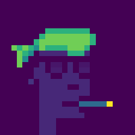

[](http://quantlet.de/)

## [](http://quantlet.de/) **Clustering of Cryptopunks NFT** [](http://quantlet.de/)

```yaml

Name of Quantlet: 'Clustering of Cryptopunks NFT'

Published in: 'DEDA-SoSe2021'

Description: 'Clustering 9999 cryptopunks into 200 clusters based on Hierarchical Clustering'

Keywords: 'Hierarchical, Clustering, Cryptopunks, NFTs, Prices' 

Author: 'Muhammad Azka, Mariia Semenenko'

See also: 'clustering-final-version.ipynb'

Submitted:  '14th July 2021'

Datafile: 'optional: for your data sets - delete if not used'

Input: 'optional'

Output:  'optional'

```





