[](http://quantlet.de/)

## [](http://quantlet.de/) **Cryptocurrencies_Sentiment_Correlation_Analysis** [](http://quantlet.de/)

```yaml

Name of Quantlet: Cryptocurrencies_Sentiment_Correlation_Analysis

Published in: DEDA-SoSe2021

Description: Benchmarking the strength of correlation between sentiment in the market and cryptocurrency performance by conducting a sentiment analysis using Twitter data 

Keywords: sentiment analysis, twitter, cryptocurrency, crosscorrelation, bitcoin

Author: Makar Evdokimov, Selen Seltuk

Datafile: https://drive.google.com/drive/folders/1z-nmjEZJMfgC4r6-Gbf5YQrzadVJ4vm2?usp=sharing

```


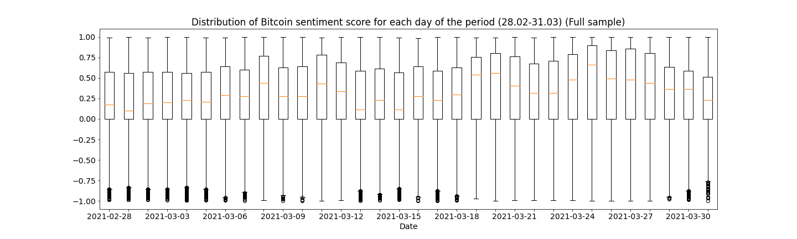

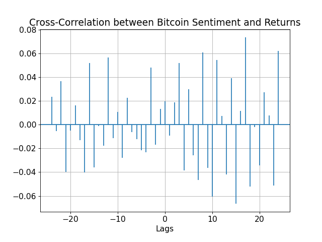

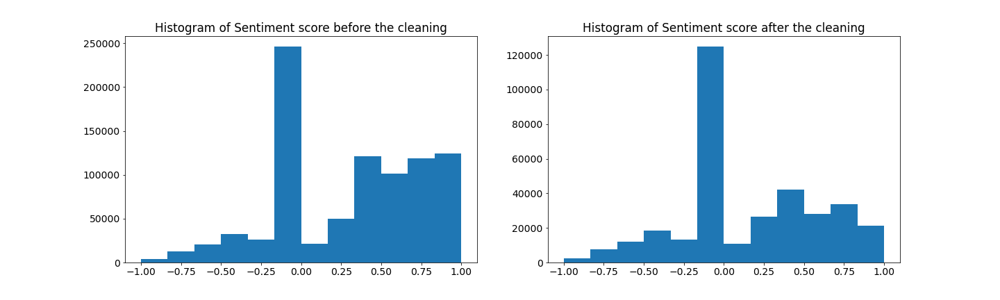

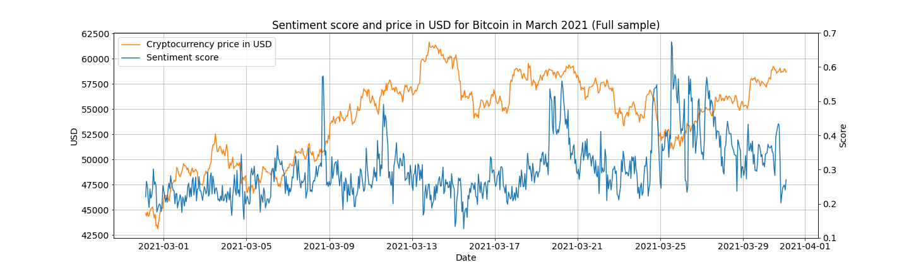

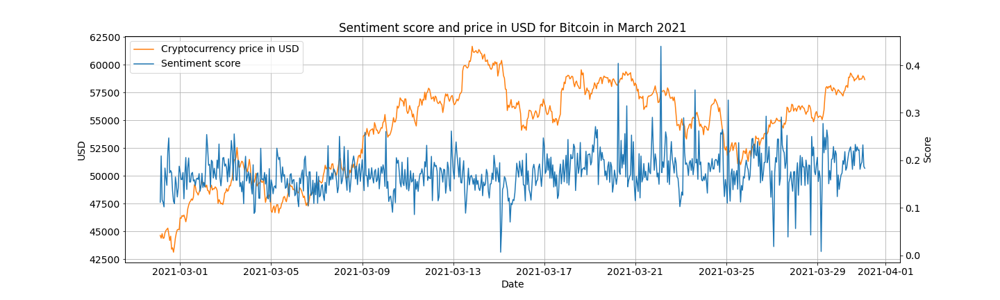

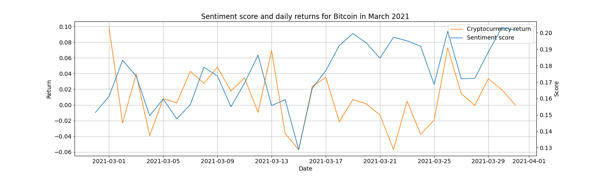

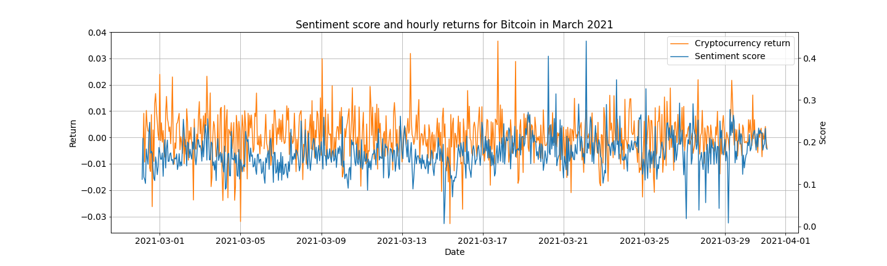

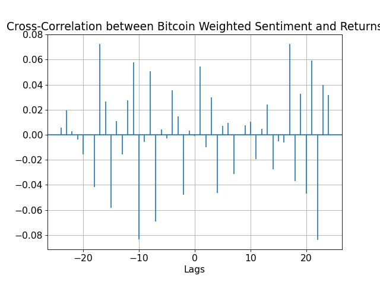

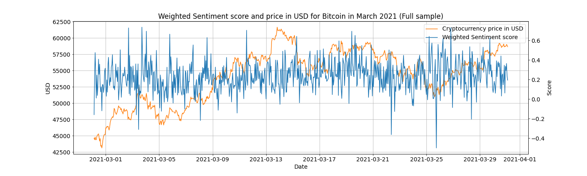

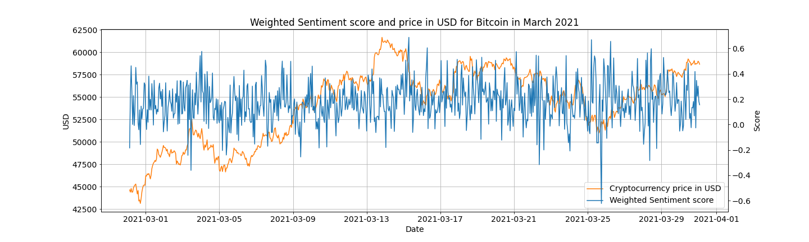

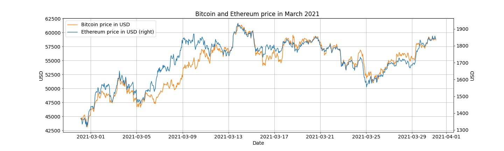

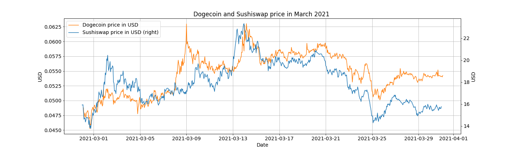